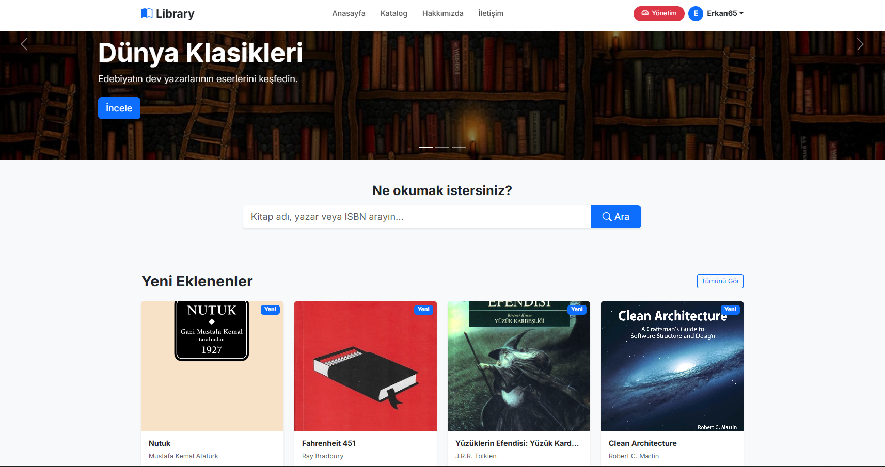
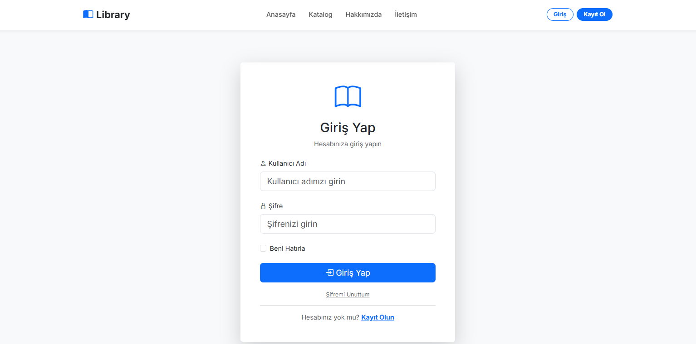
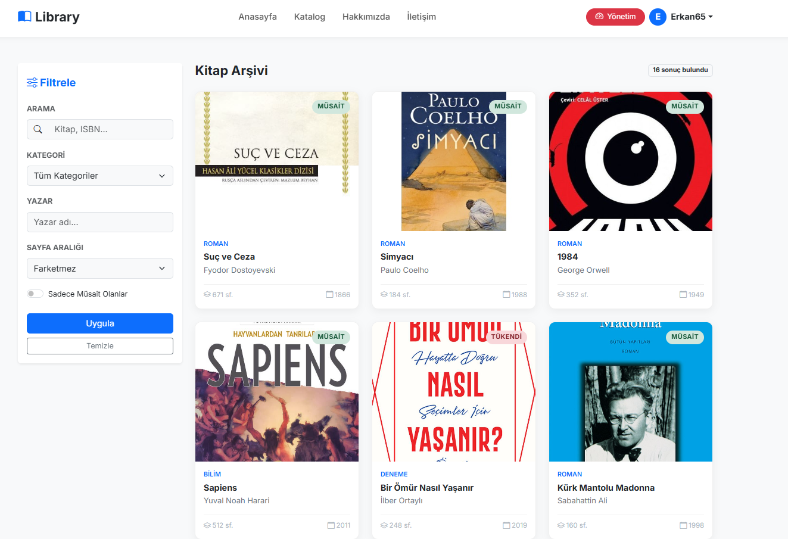
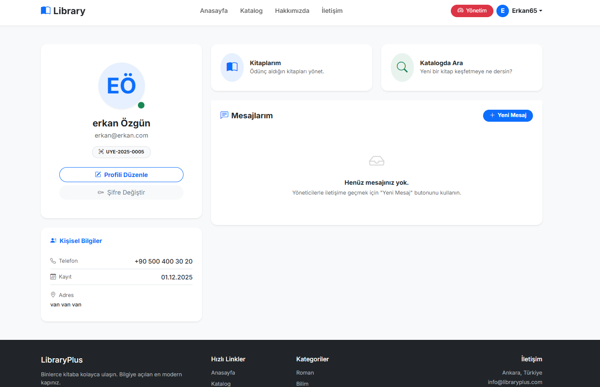

# 📚 Kütüphane Otomasyon Sistemi

Modern, hızlı ve kullanıcı dostu bir kütüphane yönetim çözümü. **Clean Architecture** prensipleriyle geliştirilmiş, ölçeklenebilir ve sürdürülebilir bir altyapıya sahiptir.

---

## ✨ Özellikler

- 📖 **Kitap Yönetimi**: Kitap ekleme, silme, güncelleme ve detaylı listeleme.
- 👤 **Üye Yönetimi**: Üye kayıtları ve profil işlemleri.
- 🔄 **Emanet Sistemi**: Kitap ödünç verme ve iade süreçlerinin takibi.
- 📊 **Dashboard**: İstatistikler ve grafiklerle desteklenmiş özet panel.
- 🛡️ **Yetkilendirme**: Role-based (Admin/Personel) erişim kontrolü.

---

## 👤 Kullanıcı Rolleri ve Yetkiler

| Rol | Yetkiler |
| :--- | :--- |
| **Admin** | Tüm sistem yönetimi, kullanıcı tanımlama, kitap ve üye yönetimi. |
| **Personel** | Emanet/İade işlemleri, kitap listeleme ve üye takibi. |

---

## 🛠️ Teknoloji Yığını

- **Dil**: C# 12 / .NET 8.0
- **Mimari**: Clean Architecture
- **Web**: ASP.NET Core MVC
- **Veritabanı**: MS SQL Server
- **ORM**: Entity Framework Core
- **Kimlik Yönetimi**: ASP.NET Core Identity
- **UI**: Bootstrap 5, jQuery, DataTables

---

## 📂 Proje Klasör Yapısı

Proje **Clean Architecture** prensiplerine uygun olarak şu şekilde yapılandırılmıştır:

- **Core**: 
  - `Kutuphane.Domain`: Entity'ler ve temel kurallar.
  - `Kutuphane.Application`: İş mantığı (Business Logic), servisler ve CQRS.
- **Infrastructure**:
  - `Kutuphane.Persistence`: Veritabanı context'i ve Repositoriyer.
  - `Kutuphane.Identity`: Kimlik doğrulama ve yetkilendirme servisleri.
- **Presentation**:
  - `Kutuphane.WebUI`: Kullanıcı arayüzü ve uygulama ana giriş noktası.

---

## 🚀 Hızlı Başlangıç

Sistemi çalıştırmak için aşağıdaki adımları izleyebilirsiniz:

1. Veritabanı bağlantı dizesini (`appsettings.json`) güncelleyin.
2. `Kutuphane.Persistence` klasöründe migration'ları uygulayın.
3. Uygulamayı çalıştırın.

Detaylı kurulum için: 👉 **[KURULUM REHBERİ (KURULUM.md)](KURULUM.md)**

---

## 🖼️ Ekran Görüntüleri

### 🏠 Ana Sayfa Dashboard

### 🔑 Giriş Paneli

### 📚 Kitap Kataloğu

### 👤 Kullanıcı Profili

---
*Bu proje modern standartlara uygun olarak geliştirilmiştir.*

